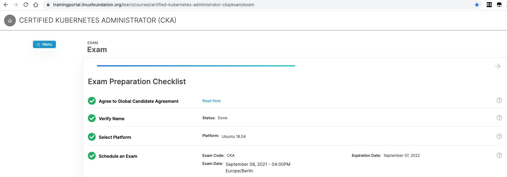

# Certified Kubernetes Administrator

This document attempts to summarise some of  the learnings and provide some tips before you give your CKA exam.  

## About this Certification

CKA was created by The Linux Foundation and the Cloud Native Computing Foundation (CNCF) as a part of their ongoing effort to help develop the Kubernetes ecosystem. The exam is an online, proctored, performance-based test that requires solving multiple tasks from a command line running Kubernetes.

## How complex is the exam

In my point of view, and view of many people I know who appeared for this exam, I can confidently say the exam is not that complex.  


## How to Prepare

I specifically referred to the below training in Udemy for my preparation, and the [kubernetes docs][kd]:  
`https://www.udemy.com/course/certified-kubernetes-administrator-with-practice-tests/`

> Curriculum: https://github.com/cncf/curriculum/blob/master/CKA_Curriculum_v1.21.pdf   
> Exam FAQ: https://docs.linuxfoundation.org/tc-docs/certification/faq-cka-ckad-cks  

## How to schedule this exam 

You can enroll for CKA certification at below path:  
`https://training.linuxfoundation.org/certification/certified-kubernetes-administrator-cka/`

  
## After Enrolling for the Certification

* Once you enroll for the exam, you have 1 year to schedule the exam.  
* Make sure your name is correct and as per the Identity document you provide. If not, you can edit it after you enroll for the exam.  



* After enroll, you get access to `killer.sh`  
  > `killer.sh` is a CKA simulator with 2 sessions (each valid for 36 hours). (The terminal access is lost after the 36 hour timeout is reached, but you have access to the solutions , hopefully indefintely.)  
  I highly recommend to go through the practise tests from `killer.sh` as this gives you a hang of the real environment, and if you get a good score with `killer.sh`, the exam should be a piece of cake(metaphorically :P).  

* After scheduling the exam, should you chose to reschedule, you can do so any number of times (within the 1 year of enrollment). 
However make sure you have more than 24 hours from the current time to the time of exam. Otherwise, you cannot reschedule.  

## Exam Tips

* Do enough mock exams. Should you do well in these mock exams, the actual exam should be easy enough.  
I did mock exams from the [Udemy course][ude] and `killer.sh`  before appearing for the exam, and understanding the solutions.  

* I did not use many aliases or env variables on the exam terminal , but the below few:  

```sh
alias k="kubectl"
export do="--dry-run=client -o yaml"
alias currcon="kubectl config current-context"
```

* Enabling Autocompletion can also save good time:  

```sh
source <(kubectl completion bash) # setup autocomplete in bash into the current shell, bash-completion package should be installed first.
echo "source <(kubectl completion bash)" >> ~/.bashrc # add autocomplete permanently to your bash shell.
```

> Reference: https://kubernetes.io/docs/reference/kubectl/cheatsheet/


## During the Exam

* Keep a valid Identity document. Your name in the portal should match the one in your Identity Document.  
* You are allowed to access Bookmarked content from your browser for reference during the exam from these allowed links.  
https://kubernetes.io/docs   
https://github.com/kubernetes   
https://kubernetes.io/blog  
  
Bookmarks are always handy. I have seen some threads where people have said the search functionality was not working on their day of exam.  
You are supposed to have at max 1 other tab opened apart from the terminal you use for exam.  
  
* Exam is proctored remotely. The proctors ask you to show around your environment to make sure you are not in violation of any policy.  
Basically make sure, you have a private and quite room and you have your audio and video sharing working properly.  
Proctor may ask you to move any things that they think could be in violation of exam policy.  

Proctoring Experience Video : https://psi.wistia.com/medias/5kidxdd0ry  
  
* You have `2` hours to complete the exam and a total of `15-20` questions.  
* Each question carries a specific weightage and is shown as `%` on the question screen, and you have a total of `100%` to reach.    
* In any case, if the session disconnects, proctor should be able to release the session again, so you can resume with the exam.  
In any case they ensure the progress is saved.  

> Note: Make sure you have a stable Internet connection on the day of exam.  

* You have a Notepad on the exam terminal, where you can store any writings for reference during the exam.  
Should you have any questions related to issues with terminal or questions on how to change language or so, you could use the Live Chat feature to ask the proctor.  


## After the Exam

* The results are mostly made available within 24 hours of the completion of exam.  
* The results are notified by mail and also available on your _linux foundation_ training portal.  
* If you pass the exam, a digital badge should be released by Credly and should end up in your mail (Usually 24 hours after exam or within 7 days ).  
* In the event you fail the exam, you have access to free 1 retake, which can be availed from the training portal.  

[ude]: <https://www.udemy.com/course/certified-kubernetes-administrator-with-practice-tests/>
[kd]: <https://kubernetes.io/docs/home/>